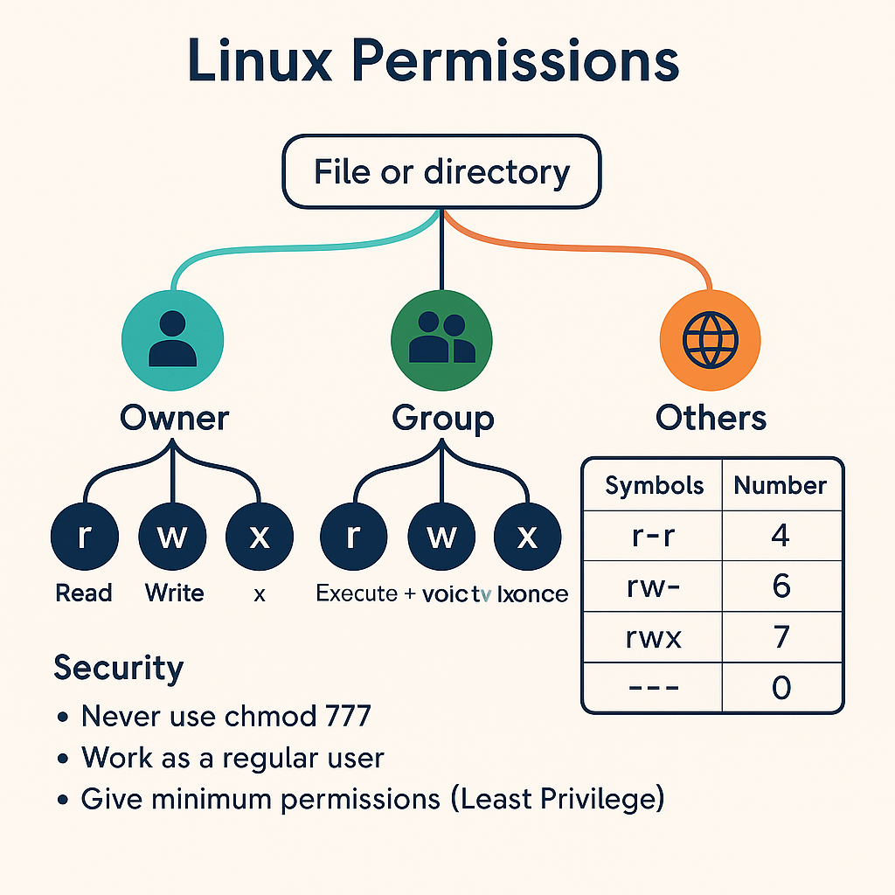

## 1. Linux
- Права: `r` (read), `w` (write), `x` (execute).
- Категории: **owner / group / others**.
- Проверка прав: `ls -l`
- Изменение:
  - `chmod` — меняет права
  - `chown` — меняет владельца
  - `chgrp` — меняет группу
- Принцип безопасности: **Least Privilege** — давать только минимально необходимые права.
- Ошибка новичков: `chmod 777` — крайне опасно!

---

## 2. English — Security Vocabulary
- permission — разрешение  
- owner — владелец  
- group — группа  
- others — остальные  
- access — доступ  
- execute — выполнять  

**Фразы:**
- *Change the file permissions.*  
- *The owner can read and write.*  

---

## 3. English — At Home
- kitchen, living room, bedroom, bathroom  
- cook dinner, clean the house, do the laundry, set the table, water the plants  

**Мини-диалог:**
- A: *The kitchen is a mess. Can you wash the dishes?*  
- B: *Sure, I’ll do it right now.*  

---

## 4. Итог урока
- Работать от обычного пользователя, `root` — только при необходимости.  
- Использовать `chmod`, `chown`, `chgrp` для управления правами.  
- Английский: закрепить новые слова (Security + At Home).  
EOF

## Mind Map

